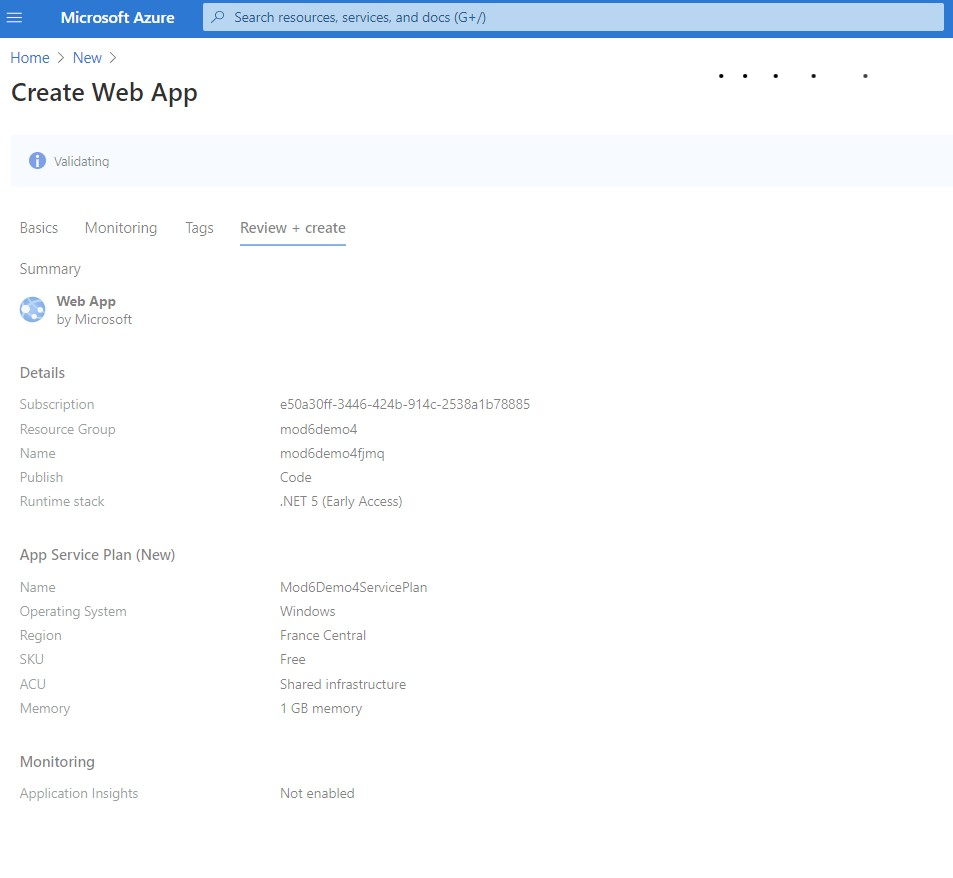
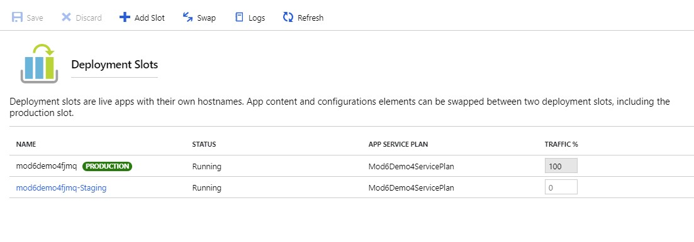
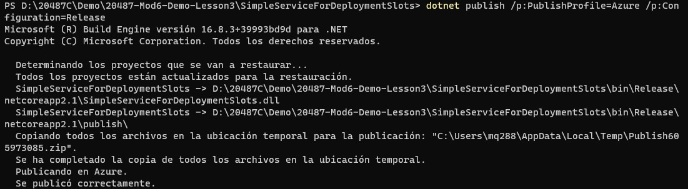
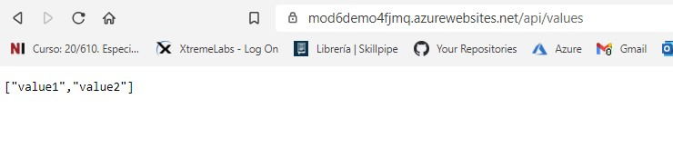
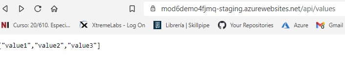
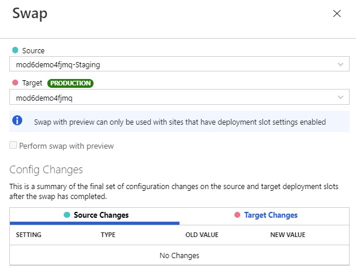
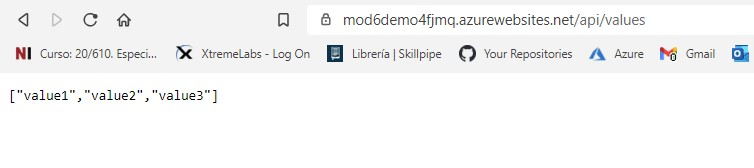

# Module 6: Deploying and Managing Services

# Lesson 4: Deploying to Staging and Production Environments 

### Demonstration: Using Deployment Slots with Web Apps

- Creamos una Web App en Azure con nombre mod6demo4fjmq



- Creamos el usuario FTP del despliegueen el  **Deployment center**

- Creamos un **Deployment slots**. con nombre Stagging

  

- Abrimos el proyecto SimpleServiceForDeploymentSlots en VSC

- actualizamos el fichero **Azure.pubxml** y el **Staging.pubxml** con los datos del FTP

- Publicamos en el slot de producción

  ```bash
  dotnet publish /p:PublishProfile=Azure /p:Configuration=Release
  ```

  

  

- Comprobamos en el navegador

  ```url
  https://Mod6Demo4fjmq.azurewebsites.net/api/values
  ```



- Cambiamos el  **ValuesController.cs**. y le añadimos un values3

- Publicamos en el slot staging

  ```bash
  dotnet publish /p:PublishProfile=Staging /p:Configuration=Release
  ```

  

- Comprobamos en el navegador

  ```url
  https://mod6demo4fjmq-staging.azurewebsites.net/api/values
  ```




- Hacemos el switch de produccion a staging

- Comprobamos en el navegador la url de produccion

  